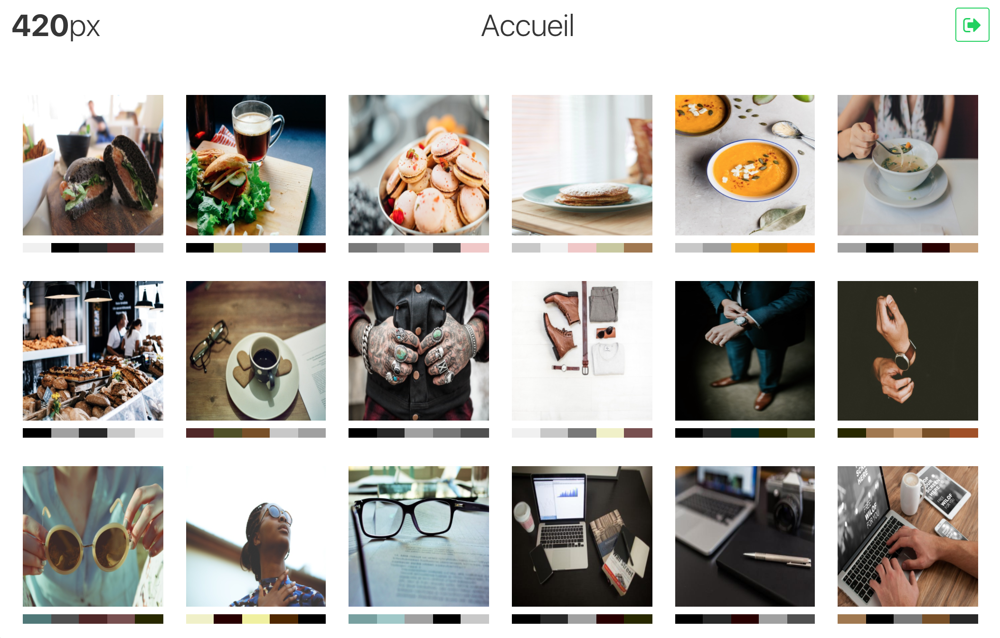
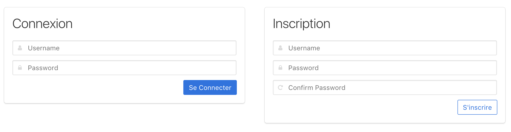
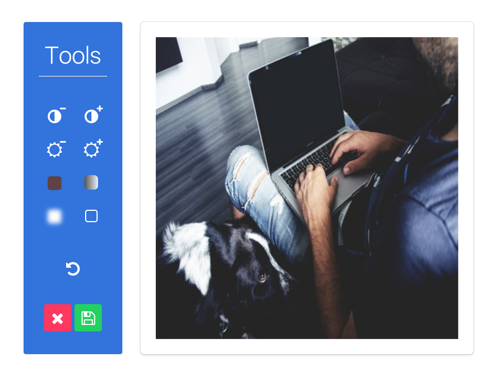
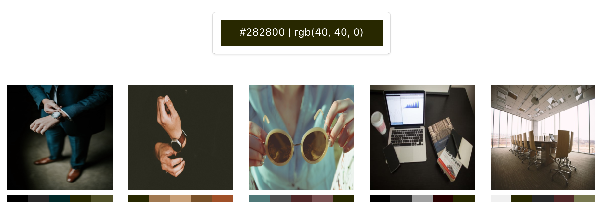

420px
=====

**420px** is a gallery website that allow users to :
 - Register/Log in
 - Post pictures
 - Edit his pictures
 - See all galleries
 - Register to a RSS flux

Requirement
-----------

Before using **420px**, you must install few things :

  - *PHP* `> 7.0`

All the project is written in PHP and some syntax need the version `7.0`. You still can user a prior version and update the syntax to work with it.

  - *MySQL*

To provide a BDD to your solution, you must install mysql and create an empty BDD. Then, set all the access in `config/database.php` and execute `schema.sql` to build your mandatory tables.

  - *ImageMagick*

[ImageMagick®](https://www.imagemagick.org/) allow the project to save and edit images. It can easily be set up and you can improve its use following the [documentation](http://php.net/manual/fr/book.imagick.php).

Screenshots
-----------

### Register / Login ###

All users can register or log in to their account.

### Edit ###

You can edit your own pictures with multiple filter, an undo and save/quit functions

### Search ###

Each pictures are followed by a line composed by its predominant colors. If you click on a color, a search is proceed to find all pictures with that contains color too.
